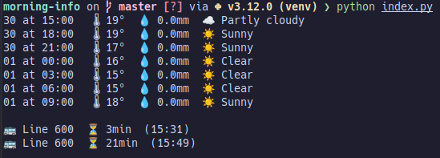

# morning-info

Preparing myself for the day by showing weather and bus information.

## Running

Assuming that the dependencies have been installed, running `python index.py` will serve
the latest information and exit:

You can also expose this as a server with `python server.py`.

## Customizing

Information displayed by default include Oporto weather and line 600. To update these,
look into `CITY` and `SCHEDULE_CHECKS` in `weather` and `bus` modules.
Will eventually look into making it customizable on start.
